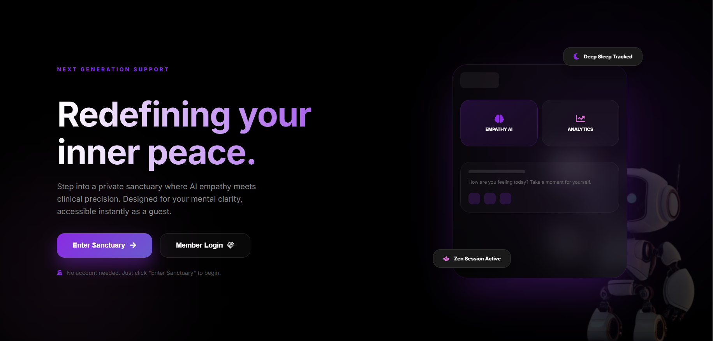
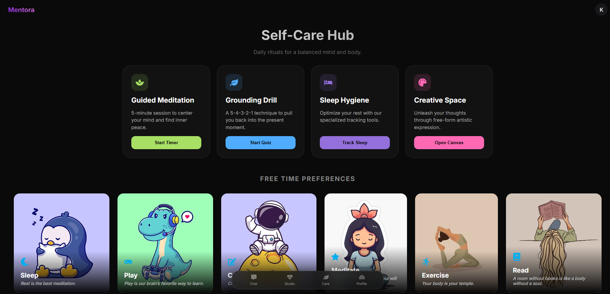
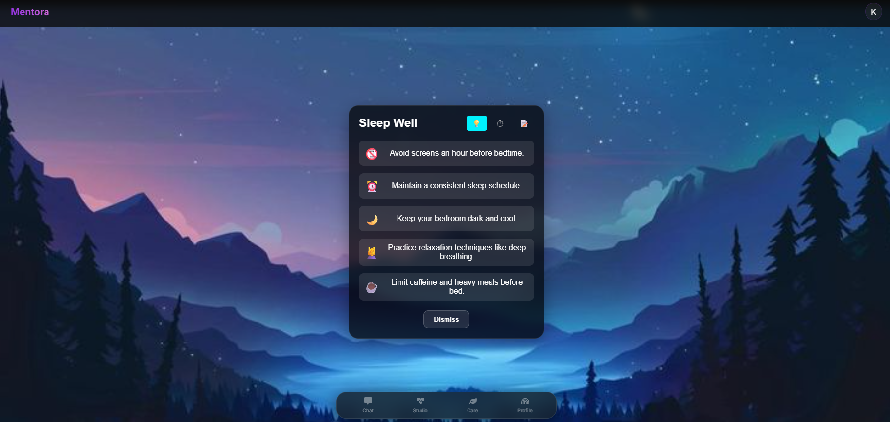
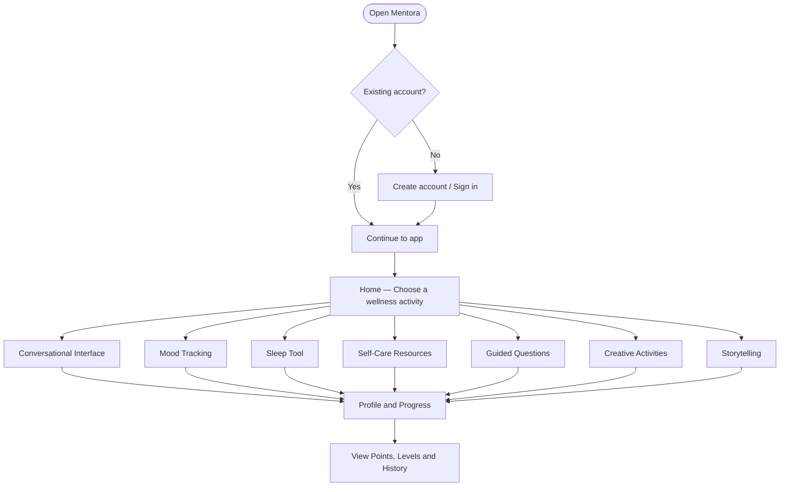
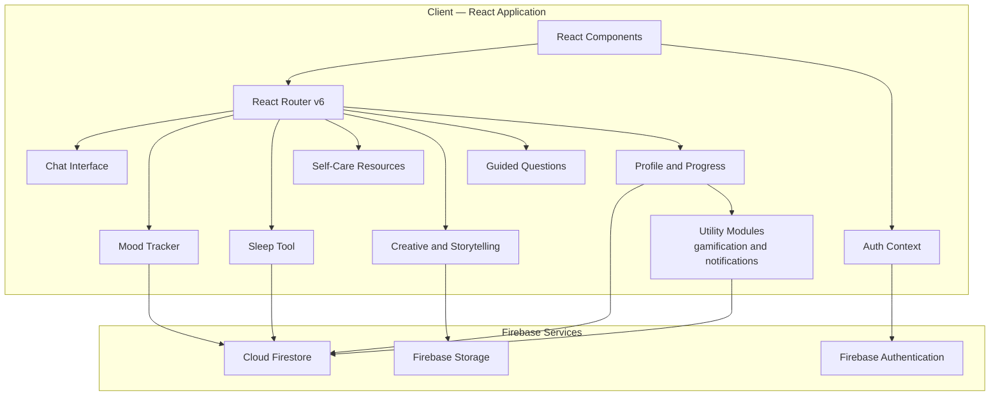
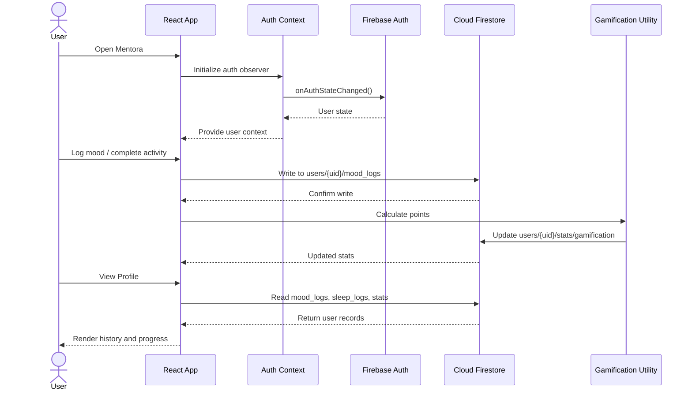
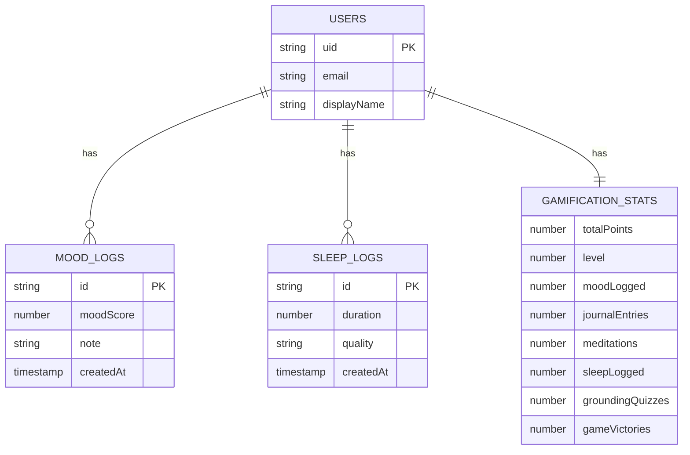

<p align="center">
  
</p>

<h1 align="center">🧠 Mentora</h1>
<h3 align="center">Mental Wellness & Self-Care Platform</h3>

<p align="center">
  <em>A digital space for self-reflection, emotional awareness, and everyday wellness.</em>
</p>

<p align="center">
  
  
  
  
  
</p>

> **Wellness disclaimer:** Mentora is intended for general wellbeing and self-reflection. It is not a medical device, does not replace a qualified mental-health professional, and should not be relied upon for diagnosis, treatment, or emergency support.

---

## 📑 Table of Contents

1. [Project Overview](#-project-overview)
2. [The Problem](#-the-problem)
3. [Our Approach](#-our-approach)
4. [Key Features](#-key-features)
5. [Screenshots](#-screenshots)
6. [User Journey](#-user-journey)
7. [Technology Stack](#-technology-stack)
8. [System Architecture](#-system-architecture)
9. [Project Structure](#-project-structure)
10. [Application Routes](#-application-routes)
11. [Authentication and User Management](#-authentication-and-user-management)
12. [Firebase and Data Management](#-firebase-and-data-management)
13. [Gamification System](#-gamification-system)
14. [Getting Started](#-getting-started)
15. [Environment Configuration](#-environment-configuration)
16. [Available Scripts](#-available-scripts)
17. [Security and Privacy](#-security-and-privacy)
18. [Testing and Quality Assurance](#-testing-and-quality-assurance)
19. [Known Limitations](#-known-limitations)
20. [Future Roadmap](#-future-roadmap)
21. [Contributing](#-contributing)
22. [License](#-license)
23. [Author](#-author)

---

## 🌿 Project Overview

Mental wellbeing is influenced by many everyday experiences, including sleep, emotional awareness, self-expression, and personal routines. However, people often use separate applications for journaling, guided exercises, habit tracking, and wellness resources.

Mentora explores how these experiences can be brought together in one web application.

The platform is organized around a collection of focused activities rather than a single interaction. Users can explore a conversational interface, record moods, access self-care resources, try sleep-related activities, respond to guided questions, and engage with creative prompts.

A profile area connects personal records with progress information, while a lightweight gamification system awards points for selected activities.

### Project goals

* Make everyday wellness activities easier to discover and use.
* Encourage regular emotional check-ins and self-reflection.
* Offer multiple ways to engage — writing, guided questions, and creative activities.
* Give authenticated users a place to review personal history and progress.
* Explore how gamification can encourage consistent participation.
* Provide a modular frontend that can be extended with additional wellness tools.

---

## 💭 The Problem

Wellness activities can become difficult to maintain when they are spread across disconnected tools.

Common challenges include:

* **Fragmented experiences:** Mood tracking, self-reflection, and wellness resources may live in different applications.
* **Inconsistent routines:** People can find it difficult to build repeatable self-care habits.
* **Limited reflection:** Recording a feeling is less useful if users cannot easily review their own history.
* **Engagement:** A wellness tool can be difficult to return to if the experience feels repetitive or impersonal.
* **Accessibility:** Users may prefer different activities, such as guided prompts, creative exercises, or sleep-related routines.

## 💡 Our Approach

Mentora combines a collection of focused experiences with account-based progress tracking.

The application includes:

1. A conversational wellness interface.
2. Dedicated tools for mood awareness and sleep-related activities.
3. Self-care resources and guided reflection.
4. Creative prompts and storytelling.
5. A profile experience for available user history.
6. Points and levels to recognize selected actions.

The intention is to support personal reflection, not to measure a person's mental health clinically or promise specific health outcomes.

---

## ✨ Key Features

### 1. 💬 Conversational Wellness Interface (Mentora.AI)

A dedicated chat experience for wellness-oriented conversations and prompts. The interface provides an approachable, safe space for users to check in with themselves through guided dialogue.

### 2. 🌱 Mood Tracking

Record and review mood-related information. The profile component queries mood records associated with the signed-in user, presenting available history for personal reflection.

### 3. 🧘 Self-Care Resources

A curated self-care section featuring guided meditation, grounding drills, sleep hygiene tips, and a creative canvas — all accessible within the main experience.

### 4. 🌙 Sleep Tool

Dedicated sleep-related tool with tracking, sleep hygiene tips, and analysis. The profile reads sleep records and contains logic for comparing mood scores and sleep duration when overlapping data is available.

### 5. ✍️ Creative Expression and Drawing

Creative prompts for writing, imagination, gratitude, and visual expression. The canvas interaction includes controls for brush color and size, offering a non-verbal path to emotional expression.

### 6. 🪷 Guided Questions and Grounding

A structured question-and-answer component with selectable options and text input — a grounded path for self-reflection using evidence-based techniques like the 5-4-3-2-1 method.

### 7. 📖 Storytelling

A dedicated storytelling component for reflective writing and imaginative activities, providing a creative counterpart to structured wellness exercises.

### 8. 👤 Authentication and User Profile

Firebase Authentication supports email/password and Google sign-in. The profile component retrieves mood history, sleep history, and gamification stats from Firestore.

### 9. 🏆 Gamification and Progress

A utility that associates selected activities with points and levels to encourage consistent participation.

### 10. 🔔 Browser Notifications and Reminders

A notification/reminder utility that works with browser notification permissions to help users maintain their wellness routines.

---

## 📸 Screenshots

<table>
  <tr>
    <td align="center"><strong>Self-Care Hub</strong></td>
    <td align="center"><strong>Sleep Tool</strong></td>
  </tr>
  <tr>
    <td></td>
    <td></td>
  </tr>
</table>

---

## 🧭 User Journey



---

## 🛠 Technology Stack

| Technology | Version | Role |
|---|---|---|
| **React** | 18 | Component-based UI |
| **React Router** | 6 | Client-side routing |
| **Create React App** | 5 | Dev server & production build |
| **Firebase Authentication** | 10 | Account access & auth state |
| **Cloud Firestore** | 10 | Mood/sleep/gamification records |
| **Firebase Storage** | 10 | File-oriented feature storage |
| **Framer Motion** | 12 | Animations & transitions |
| **React Icons** | 5 | Interface icons |
| **Font Awesome** | 6 | Additional icon resources |
| **Recharts** | 3 | Data visualization & charts |
| **React Confetti** | 6 | Celebratory gamification effects |
| **React Testing Library** | 13 | UI testing utilities |
| **Jest / CRA test runner** | — | Test execution |

---

## 🏗 System Architecture

### 1. High-Level Component Architecture



### 2. Authentication & Data Flow



### 3. Firestore Data Model



---

## 📁 Project Structure

```text
Mentora/
├── public/
│   ├── chatresponse.json       # Local chat response data
│   ├── index.html
│   └── manifest.json
├── src/
│   ├── assets/
│   │   ├── mentora.png         # Landing page banner
│   │   ├── UI_1.png            # Self-Care Hub screenshot
│   │   └── UI_2.png            # Sleep Tool screenshot
│   ├── Components/
│   │   ├── ChatInterface.js    # Mentora.AI chat wrapper
│   │   ├── chat.js             # Chat logic & responses
│   │   ├── HomePage.js         # Landing / home page
│   │   ├── LoginPage.js        # Login & registration
│   │   ├── MoodTracker.js      # Mood-tracking interface
│   │   ├── SelfCareResources.js# Self-care hub
│   │   ├── Sleeptool.js        # Sleep-related activity
│   │   ├── QuestionAns.js      # Guided Q&A / grounding
│   │   ├── Creative.js         # Creative prompts & canvas
│   │   ├── Storyteller.jsx     # Storytelling experience
│   │   ├── Profile.js          # User history & progress
│   │   └── RequireAuth.js      # Route-protection helper
│   ├── contexts/
│   │   └── AuthContext.js      # Shared authentication state
│   ├── firebase/
│   │   └── firebase.js         # Firebase app & service init
│   ├── utils/
│   │   ├── gamification.js     # Points & level calculation
│   │   └── notifications.js    # Browser notification helpers
│   ├── App.js                  # Root layout & route composition
│   ├── App.css
│   └── index.js
├── .env.example                # Environment variable template (safe to commit)
├── .gitignore
├── package.json
└── README.md
```

---

## 🗺 Application Routes

| Route | Component | Purpose | Access |
|---|---|---|---|
| `/` | `HomePage` | Landing page | Public |
| `/login` | `LoginPage` | Login & registration | Public |
| `/chat/chatbot` | `ChatInterface` | Conversational AI interface | App layout |
| `/chat/mood-tracker` | `MoodTracker` | Mood logging & history | App layout |
| `/chat/self-care` | `SelfCareResources` | Self-care hub | App layout |
| `/chat/story` | `Storyteller` | Storytelling experience | App layout |
| `/chat/profile` | `Profile` | Profile, history & progress | **Protected** |
| `/chat/question-ans` | `QuestionAns` | Guided grounding questions | App layout |
| `/chat/sleeptool` | `Sleeptool` | Sleep tracking & tips | App layout |
| `/chat/creative` | `Creative` | Creative prompts & canvas | App layout |

---

## 🔐 Authentication and User Management

Mentora uses Firebase Authentication rather than implementing password storage itself.

### Supported sign-in methods

| Method | Status |
|---|---|
| Email & Password registration | Supported |
| Email & Password sign-in | Supported |
| Google sign-in (popup) | Supported |
| Auth state persistence | Supported |
| Logout | Supported |

### Authentication flow

1. App initializes the authentication context on mount.
2. Firebase reports the current authentication state via `onAuthStateChanged`.
3. The shared context updates the application's user state.
4. Sign-in and registration actions call Firebase Authentication.
5. Successful sign-in updates the authentication state across the app.
6. Protected profile navigation checks whether a user is authenticated.
7. Logout ends the Firebase session and clears local state.

---

## 🗄 Firebase and Data Management

### Firestore collection paths

```
users/{uid}/mood_logs           — Mood records ordered by createdAt
users/{uid}/sleep_logs          — Sleep records ordered by createdAt
users/{uid}/stats/gamification  — Gamification stats document
```

### Recommended Firestore Security Rules

```javascript
rules_version = '2';
service cloud.firestore {
  match /databases/{database}/documents {
    match /users/{uid}/{document=**} {
      allow read, write: if request.auth != null && request.auth.uid == uid;
    }
  }
}
```

> **Important:** Client-side route protection is not a substitute for server-side authorization. Firestore rules must independently enforce access restrictions for private records.

---

## 🏆 Gamification System

The gamification utility maps selected activities to points.

| Activity | Points |
|---|---:|
| Mood logged | 10 |
| Journal entry | 15 |
| Meditation | 20 |
| Sleep logged | 10 |
| Grounding quiz | 15 |
| Game victory | 5 |

### Level calculation

The utility uses **100 total points per level** as its threshold:

| Points Range | Level |
|---|---|
| 0 – 99 | Level 1 |
| 100 – 199 | Level 2 |
| 200 – 299 | Level 3 |
| n×100 to (n+1)×100 − 1 | Level n + 1 |

---

## 🚀 Getting Started

### Prerequisites

* Node.js ≥ 16 and npm
* A Firebase project with Authentication and Firestore enabled

### Step 1 — Clone the repository

```bash
git clone https://github.com/Komalgiri/Mentora.git
cd Mentora
```

### Step 2 — Install dependencies

```bash
npm install
```

### Step 3 — Configure Firebase

```bash
cp .env.example .env.local
# Edit .env.local and add your Firebase project values
```

### Step 4 — Start the development server

```bash
npm start
# Serves at http://localhost:3000
```

### Step 5 — Build for production

```bash
npm run build
```

---

## ⚙️ Environment Configuration

Copy `.env.example` to `.env.local` and fill in your Firebase project credentials:

```env
REACT_APP_FIREBASE_API_KEY=your-firebase-web-api-key
REACT_APP_FIREBASE_AUTH_DOMAIN=your-project.firebaseapp.com
REACT_APP_FIREBASE_PROJECT_ID=your-project-id
REACT_APP_FIREBASE_STORAGE_BUCKET=your-project.firebasestorage.app
REACT_APP_FIREBASE_MESSAGING_SENDER_ID=your-sender-id
REACT_APP_FIREBASE_APP_ID=1:your-sender-id:web:your-app-id
REACT_APP_FIREBASE_MEASUREMENT_ID=G-XXXXXXXXXX
```

> **Never commit `.env.local`** or any file containing real Firebase credentials to Git. The `.gitignore` already excludes it.

### Firebase Console Setup

1. Open your Firebase project console.
2. Enable **Email/Password** authentication.
3. Enable **Google** authentication (if required).
4. Configure **Cloud Firestore** and apply restrictive Security Rules.
5. Add `localhost` and your production domain to Firebase's **Authorized Domains**.

---

## 📜 Available Scripts

| Command | Description |
|---|---|
| `npm start` | Start the local development server at `http://localhost:3000` |
| `npm run build` | Create an optimized production build in `build/` |
| `npm test` | Run the Create React App test runner |
| `npm run eject` | Eject CRA build config *(one-way — use with caution)* |

---

## 🛡 Security and Privacy

> Mentora may handle mood logs, personal reflections, sleep records, and conversational content. This information requires careful protection.

* Restrict each user's private records to that user via Firestore rules.
* Do not use client-side route guards as the only authorization mechanism.
* Explain what information is collected and why via a clear privacy notice.
* Avoid sending private user content to third-party services without disclosure.
* Provide a documented process for users to request deletion of their data.
* Do not claim to diagnose or treat mental-health conditions.
* Do not position Mentora as an emergency or crisis-response service.

---

## 🧪 Testing and Quality Assurance

```bash
npm test        # Run unit and component tests
npm run build   # Verify production build succeeds
```

### Recommended test coverage

| Layer | Examples |
|---|---|
| **Unit** | Gamification calculations, form validation, notification helpers |
| **Component** | Login form, protected route, mood tracker, profile rendering |
| **Integration** | Sign-up to profile access, mood write and profile read, point award flow |
| **Manual** | Desktop and mobile layouts, keyboard navigation, empty/error states |

---

## ⚠️ Known Limitations

* **Chat behavior** — The repository includes local chat response data (`chatresponse.json`). Confirm whether responses are predefined, AI-generated, or a combination.
* **Data consistency** — Mood, sleep, and gamification records need consistent field names, validation, timestamps, and error handling across all components.
* **Gamification integrity** — Client-side point calculations can be manipulated; consider server-side validation for important progress records.
* **Notifications** — Browser notification behavior varies across environments; verify behavior when the app is in the background or closed.
* **Privacy lifecycle** — Data export and deletion workflows should be implemented and tested before production deployment.

---

## 🗺 Future Roadmap

### Phase 1 — Reliability
- [ ] Verify all routes and core user flows
- [ ] Improve loading and error states
- [ ] Validate mood and sleep data schemas
- [ ] Prevent duplicate gamification awards
- [ ] Add automated tests for auth and profile

### Phase 2 — Privacy and User Control
- [ ] Review and test Firestore Security Rules
- [ ] Add privacy notice and consent flow
- [ ] Provide account-data export and deletion
- [ ] Add optional reminder controls
- [ ] Improve chat data transparency

### Phase 3 — Product Experience
- [ ] Improve accessibility and responsive layout
- [ ] Add more self-care resource categories
- [ ] Allow users to revisit favorite activities
- [ ] Enhance history and progress visualization
- [ ] Add clear point and level explanations

### Phase 4 — Responsible Wellness AI
- [ ] Clearly define chatbot capabilities and limitations
- [ ] Evaluate response quality and safety before expanding AI behavior
- [ ] Add appropriate escalation guidance for high-risk conversations
- [ ] Seek qualified professional input before making health-related claims

---

## 🤝 Contributing

Contributions, bug reports, and suggestions are welcome.

### Contribution workflow

1. Fork the repository.
2. Create a focused branch: `git checkout -b feature/your-feature`
3. Keep changes consistent with the existing React structure.
4. Test the affected feature locally.
5. Run `npm test` and `npm run build`.
6. Open a pull request explaining the change and how it was tested.

### Reporting issues

Please include:
* A concise description of the problem
* Steps to reproduce it
* Expected vs. actual behavior
* Browser and OS information
* Relevant console errors (with personal info removed)

---

## 📄 License

This project is licensed under the **MIT License**. See the [LICENSE](LICENSE) file for details.

---

## 👩‍💻 Author

**Komal Giri**

* GitHub: [@Komalgiri](https://github.com/Komalgiri)
* Repository: [Komalgiri/Mentora](https://github.com/Komalgiri/Mentora)

---

*Mentora — making space for reflection, one small step at a time. 🌿*
